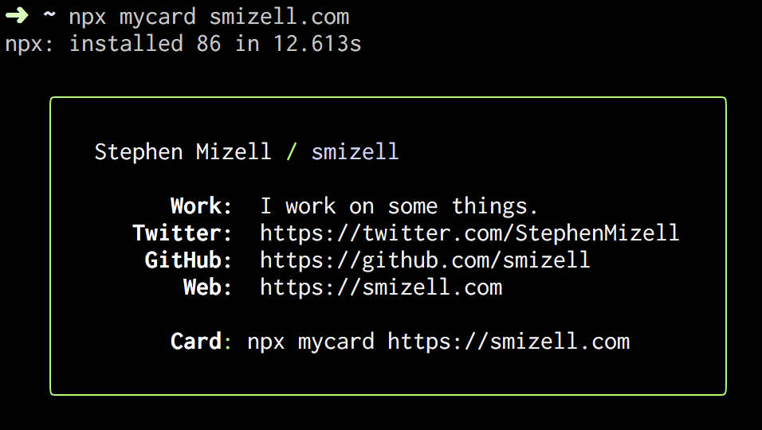

# My Card

My Card is a library for generating business cards using the magic of `npx`. You give it your personal web site, it looks for a special `card.json` file, and displays the content in the terminal window. Read below to find out how to use it and create your own `card.json` file.



This is a little library inspired by a [tweet](https://twitter.com/mikeal/status/1075510640465199104) and forked from [Mikeal's repo](https://github.com/mikeal/bitandbang) which was forked from the [original](https://github.com/bnb/bitandbang).

# Usage

```sh
npx mycard <your-domain>
```

Replace `<your-domain>` with something like `https://smizell.com` and it will look for `https://smizell.com/card.json`. If you leave off the protocol, this script will assume `https`.

## `card.json`

This script looks for a file at `<your-domain>/card.json`.  Below is an example of what your `card.json` script might look like. You can make as many items as you like here.

```json
{
  "name": "Stephen Mizell",
  "handle": "smizell",
  "items": [
    {
      "label": "Work",
      "content": "I work on some things."
    },
    {
      "label": "Twitter",
      "content": "https://twitter.com/StephenMizell"
    },
    {
      "label": "GitHub",
      "content": "https://github.com/smizell"
    },
    {
      "label": "Web",
      "content": "https://smizell.com"
    }
  ]
}
```

Make that available under your domain and `/card.json`, run the command, and see your card.
